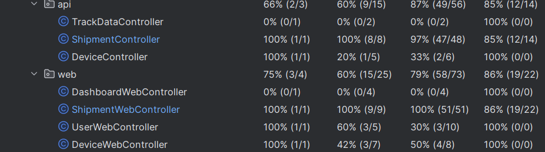
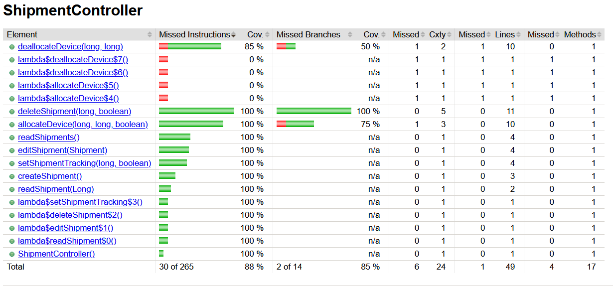
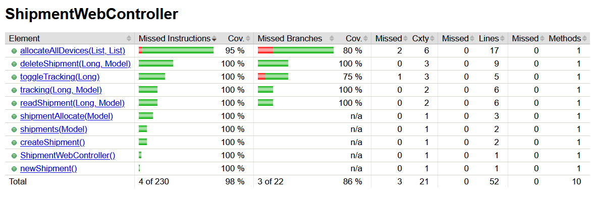

# Shipment Management Module :

## Requirements:

### Functional requirements:

An authenticated user shall be able to create a shipment via the API or the web interface.

A shipment shall consist of:
    - a unique identifier
    - a name
    - tracking status (enabled / disabled)

An authenticated user shall be able to allocate/deallocate a device to a shipment.
An authenticated user shall be able to create/edit/delete a shipment.

### Business rules:

A device shall be associated with at most one shipment at any given time.

A shipment may be associated with zero or more devices.

### Api specific requirements:

The API endpoint for creating a shipment shall return a confirmation indicating whether the shipment was successfully created.

The API endpoint for allocating a device to a shipment shall return a confirmation indicating whether the association was successful.

The API endpoint for allocating a device to a shipment shall fail if the device is already associated with another shipment .
The association can be forced if the user wants by adding a parameter to the api call that represents if the allocation should be forced.
The parameter value is at false by default.

The API endpoint for reading a shipment shall return shipment matching the given id or HTTP_NOT_FOUND is the shipment's id
is not in the database.

The API endpoint for deleting a shipment should only work if the shipment has no devices
allocated or if the deletion is forced.

### Web specific requirements:

The user shall not be able to allocate multiple shipments to one device visually through the interface to avoid confusion.

The allocation of an already allocated device to another shipment shall generate a pop-up to warn the user of the
existing allocation and prompt the user if he wants to allocate anyway by deallocating the device from the other shipment.

## Scenarios :

### Scenario 1: 
An authenticated user wants to allocate a device a shipment through the web application/api.
We assume that the shipment has already been created and that the device has been provisioned.

#### Normal flow : 
The device is allocated to the desired shipment through the web interface or by an api call.

#### What can go wrong : 
The device is already associated to a shipment. In that case the user should be
warned that the device is already allocated to another shipment and asked if they want to deallocate it
from its current shipment and allocate it to the desired shipment. if the action is done from the api, 
a parameter should be given to force the allocation, if not forced and the device is already allocated 
to another shipment, the api call should return an HTTP_CONFLICT response.
The device to allocate do not exist (id missing from database), in that case the user
should be warned by a pop-up if the user is on the web interface or with the HTTP_NOT_FOUND response is he is using
the api.

### Scenario 2: 
An authenticated user wants to delete an existing shipment.

#### Normal flow: 
The user clicks on the delete_shipment button of the desired shipment in the shipment list or
makes an api call with the id of the shipments he wants to delete.The shipment is deleted from the database
and the change is visible on the web page.

#### What can go wrong : 
The shipment doesn't exist/has been deleted. In that case, the web page should reload to
synchronize with the database. The api call should return HTTP_NOT_FOUND response to warn the user.
The shipment has devices allocated, in that case a pop-up should prompt the user for confirmation.If
the api call is used, a bool should be used as a parameter to represent if the deletion should take place
even if the shipment is not empty.

### Scenario 3: 
An authenticated user wants to display a shipment information from the web application
or through the api.

#### Normal flow: 
The user click on the shipment he wants to inspect through the web interface or makes
an api call and gives the id of the shipment.The user is shown the shipment information.

#### What can go wrong: 
The shipment doesn't exist/has been deleted. In that case, the web interface should reload
to synchronize with the database. The api should return an HTTP_NOT_FOUND response.

### Scenario 4: 
An authenticated user wants to change the tracking status of a shipment.

#### Normal flow: 
The user go to the tracking page of the desired shipment and click on a button to change
the tracking status.The user is then redirected to the list of shipments where the column showing the tracking status
should have been updated to reflect the change. If done through the api, the user specify the shipment's id and
the desired tracking status. The user receives a bool confirming if the change was made or not.

#### What can go wrong : 
The shipment doesn't exist (deleted/missing from database).In that case, the web page should reload
to match the database.The api call should return HTTP_NOT_FOUND.

### Scenario 5:  
An authenticated user wants to deallocate a device from a shipment.

#### Normal flow: 
The user after login in goes to the shipment list page where he can
then go to the device allocation page. Through this page, he can locate the device he wants to deallocate by
setting the associated shipment to -1 via dropdown menu.
If done through the api, the user gives the id of the device and the id of the shipment supposed to be associated
to the device.

#### What can go wrong: 
If done through the web application, the device or shipment could be deleted before the
user confirms. In that case, the user should be redirected normally to the shipment list.
If done through the api, the shipment's id or/and the device's id could be missing from the database.
In that case the api call should return a NOT_FOUND exception. If instead the shipment is not associated
to the device it should return a CONFLICT.

## Tests :

### Unit tests coverage :

#### Shipment Controller :

#### Shipment Web Controller :

### Acceptance tests :

#### Api :

* Create a shipment.
* Create a shipment and then read its information.
* Reading a non-existent shipment's information.
* Create a shipment and then editing its information.
* Create a shipment and then delete it.
* Deleting a non-existent shipment.
* Deleting a non-empty shipment and then trying to delete it without 
forcing the deletion and then forcing the deletion.
* Create 2 shipments and then read their information.
* Create a shipment and toggle its tracking status.

#### Web :

* Create a shipment.
* Create a shipment and toggle its tracking status (true to false).
* Create a shipment,provision a device and then allocate the device to the shipment.
* Create a shipment,provision a device, allocate the device to the shipment and then deallocate it.
* Create a shipment and delete it.
* Create a shipment and display its information.